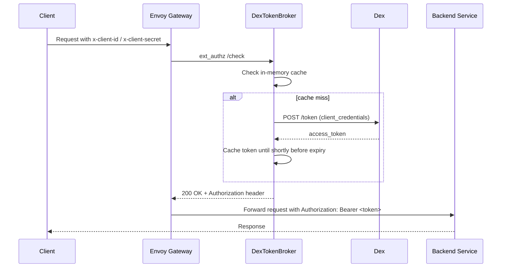

<div align="center">
  
  <h1>Dex Token Broker</h1>
  <p>Trading OAuth2 tokens from Dex for Envoy Gateway.</p>
</div>

DexTokenBroker is a lightweight external authorization service for Envoy Gateway. It performs OAuth2 `client_credentials` requests against Dex, caches access tokens in memory, and returns `Authorization: Bearer ...` headers that Envoy can forward to backend services.

The project is built for the `ext_authz` pattern: Envoy calls DexTokenBroker first, DexTokenBroker fetches or reuses a token, and the backend receives an already-authorized request.

## Why this exists

Envoy Gateway is good at routing, policy enforcement, and header forwarding, but it does not natively execute OAuth2 client flows. If your backend trusts Dex-issued access tokens and Dex is only reachable inside the cluster, you need a small broker between Envoy and Dex.

DexTokenBroker fills that gap.

## Features

- Small Go service with no third-party runtime dependencies
- Designed for Envoy Gateway `ext_authz`
- OAuth2 `client_credentials` support against Dex
- In-memory token cache with periodic cleanup
- Bounded cache size with a simple eviction policy
- Cache key includes a hash of the client secret, so rotated or incorrect secrets do not reuse another token
- In-flight request deduplication to avoid token refresh storms
- TLS-to-Dex by default, with an explicit insecure opt-out for local or trusted-network testing
- Strict request validation and bounded upstream response parsing
- Configurable inbound and outbound header names
- Optional static credentials mode for secret injection from the runtime environment
- Stateless per pod
- Ready for Docker and Kubernetes
- GitHub Actions CI
- GitHub Container Registry publishing
- Release Please for SemVer + Conventional Commits
- Dependabot for Go modules, Docker, and GitHub Actions
- Security workflow with `govulncheck` and Trivy

## Request flow



## Project layout

```text
.
├── .github/
│   ├── dependabot.yml
│   └── workflows/
├── cmd/dextokenbroker/
├── internal/tokenbroker/
├── CHANGELOG.md
├── Dockerfile
├── Makefile
└── README.md
```

## Configuration

DexTokenBroker is configured with environment variables:

| Variable | Default | Description |
| --- | --- | --- |
| `LISTEN_ADDR` | `:8080` | HTTP listen address |
| `DEX_TOKEN_URL` | `https://dex.dex.svc.cluster.local/token` | Dex OAuth2 token endpoint |
| `HTTP_TIMEOUT` | `5s` | Timeout for outbound token requests |
| `CACHE_CLEANUP_INTERVAL` | `5m` | How often expired tokens are removed |
| `EXPIRY_SAFETY_MARGIN` | `30s` | Buffer subtracted from `expires_in` before a token is treated as expired |
| `CACHE_MAX_ENTRIES` | `1024` | Maximum number of cached token entries; `0` disables caching |
| `ALLOW_INSECURE_DEX_URL` | `false` | Allow plain `http://` Dex token endpoints for local development or trusted internal networks |
| `LOG_LEVEL` | `INFO` | Log level for the service logger |
| `SHUTDOWN_TIMEOUT` | `10s` | Graceful shutdown timeout |
| `UPSTREAM_AUTH_HEADER` | `Authorization` | Header returned to Envoy for the backend request |
| `CLIENT_ID_HEADER` | `x-client-id` | Header name used to read the OAuth client ID |
| `CLIENT_SECRET_HEADER` | `x-client-secret` | Header name used to read the OAuth client secret |
| `SCOPE_HEADER` | `x-scope` | Header name used to read the OAuth scope |
| `STATIC_CLIENT_ID` | empty | Fixed OAuth client ID; when set together with `STATIC_CLIENT_SECRET`, incoming credential headers are ignored |
| `STATIC_CLIENT_SECRET` | empty | Fixed OAuth client secret for static credential mode |
| `STATIC_SCOPE` | empty | Fixed OAuth scope for static credential mode |

## API

### `POST /check`

Expected request headers by default:

- `x-client-id`
- `x-client-secret`
- `x-scope` (optional)

Those names can be changed with `CLIENT_ID_HEADER`, `CLIENT_SECRET_HEADER`, and `SCOPE_HEADER`.

Success response:

```http
HTTP/1.1 200 OK
Authorization: Bearer <access_token>
```

Failure responses:

- `401 Unauthorized` for missing or rejected credentials
- `502 Bad Gateway` for invalid responses from Dex
- `503 Service Unavailable` if Dex cannot be reached

### `GET /healthz`

Returns `200 OK` with body `ok`.

## Local development

Run the broker locally:

```bash
go run ./cmd/dextokenbroker
```

Run tests:

```bash
go test ./...
```

Format code:

```bash
make fmt
```

Build the binary:

```bash
make build
```

Print version information:

```bash
go run ./cmd/dextokenbroker --version
```

## Docker

Build the container locally:

```bash
docker build -t dextokenbroker:dev .
```

Run it:

```bash
docker run \
  -p 8080:8080 \
  -e DEX_TOKEN_URL=https://dex.dex.svc.cluster.local/token \
  dextokenbroker:dev
```

Published images are intended for GitHub Container Registry:

```text
ghcr.io/matzegebbe/dextokenbroker
```

Release tags publish at least these image tags:

- `v1.2.3`
- `1.2.3`
- `1.2`
- `latest`

Example configuration files:

- [.env.example](.env.example)
- [examples/k8s-deployment.yml](examples/k8s-deployment.yml)

## Envoy Gateway integration

The simplest pattern is to have DexTokenBroker return the final `Authorization` header and let Envoy forward that header upstream.

Conceptually the setup looks like this:

1. The client calls an `HTTPRoute` on Envoy Gateway.
2. Envoy sends an `ext_authz` request to DexTokenBroker at `/check`.
3. Envoy forwards `x-client-id`, `x-client-secret`, and optionally `x-scope` to DexTokenBroker.
4. DexTokenBroker returns `Authorization: Bearer <token>`.
5. Envoy forwards that `Authorization` header to the backend service.

If you change `UPSTREAM_AUTH_HEADER`, Envoy must forward that header name instead.

Example `SecurityPolicy` shape:

```yaml
apiVersion: gateway.envoyproxy.io/v1alpha1
kind: SecurityPolicy
metadata:
  name: dex-token-broker
spec:
  targetRefs:
    - group: gateway.networking.k8s.io
      kind: HTTPRoute
      name: my-api
  extAuth:
    headersToExtAuth:
      - x-client-id
      - x-client-secret
      - x-scope
    http:
      backendRefs:
        - name: dex-token-broker
          port: 8080
      path: /check
      headersToBackend:
        - Authorization
```

Field names and placement have shifted across some Envoy Gateway releases, so treat the YAML above as the target pattern and align it with the exact version of Envoy Gateway you deploy.

## Kubernetes example

Minimal Deployment:

```yaml
apiVersion: apps/v1
kind: Deployment
metadata:
  name: dex-token-broker
spec:
  replicas: 2
  selector:
    matchLabels:
      app: dex-token-broker
  template:
    metadata:
      labels:
        app: dex-token-broker
    spec:
      containers:
        - name: dex-token-broker
          image: ghcr.io/matzegebbe/dextokenbroker:latest
          ports:
            - containerPort: 8080
          env:
            - name: DEX_TOKEN_URL
              value: https://dex.dex.svc.cluster.local/token
          securityContext:
            allowPrivilegeEscalation: false
            capabilities:
              drop:
                - ALL
            readOnlyRootFilesystem: true
            runAsNonRoot: true
            seccompProfile:
              type: RuntimeDefault
          readinessProbe:
            httpGet:
              path: /healthz
              port: 8080
          livenessProbe:
            httpGet:
              path: /healthz
              port: 8080
```

## Cache behavior

The cache stores tokens, not raw credentials.

The cache key is derived from:

- `client_id`
- `scope`
- SHA-256 hash of `client_secret`

That keeps the service stateless while preventing a token minted for one secret from being reused by a different secret for the same client ID.

The cache is bounded by `CACHE_MAX_ENTRIES`. When the cache reaches capacity, DexTokenBroker first removes expired entries and then evicts the entry that expires soonest.

Expired tokens are removed in two ways:

- lazily on read when an expired entry is accessed
- periodically by a background cleanup goroutine

The broker also deduplicates concurrent cache misses per cache key, which helps avoid a burst of identical `/token` requests when a token expires under load.

## Security notes

- Always use TLS between clients, Envoy Gateway, DexTokenBroker, and Dex.
- DexTokenBroker rejects insecure `http://` Dex endpoints by default. If you intentionally run Dex over plain HTTP, set `ALLOW_INSECURE_DEX_URL=true`.
- Do not log client secrets.
- `x-client-id`, `x-client-secret`, and `x-scope` are length-limited and rejected if they contain control characters.
- Dex token responses are size-limited and the broker rejects non-Bearer token types.
- If all traffic should use one fixed machine client, prefer storing the credentials in Kubernetes Secrets and letting DexTokenBroker own them instead of forwarding credentials from external clients.
- `STATIC_CLIENT_ID` and `STATIC_CLIENT_SECRET` are intended for that fixed machine-client mode.
- The in-memory cache is pod-local by design. That keeps the service simple, but each replica has its own cache.
- The published container image is non-root, distroless, emits SBOM/provenance on release, and is scanned in CI.

## CI, releases, and automation

This repository is set up for GitHub from day one.

### CI

`.github/workflows/ci.yml` runs on pushes to `main` and on pull requests. It:

- checks `gofmt`
- runs `go test ./...`
- runs `govulncheck ./...`
- builds the binary
- builds the Docker image

### Conventional Commits

Commit messages should follow Conventional Commits so Release Please can determine the next semantic version.

Examples:

```text
feat: add optional static credentials mode
fix: return 503 when dex is unavailable
docs: expand envoy gateway integration guide
chore(ci): update build-push-action
```

### Semantic Versioning

Releases follow SemVer:

- `fix:` -> patch release
- `feat:` -> minor release
- `feat!:` or `BREAKING CHANGE:` -> major release

### Release Please

`.github/workflows/release-please.yml` and the two `.release-please-*` files manage releases.

If you want the release tag and GitHub release created by Release Please to trigger downstream workflows such as the container publish job, create a repository secret named `RELEASE_PLEASE_PAT`. The workflow uses that secret when present and falls back to `GITHUB_TOKEN` otherwise.

Flow:

1. Merge conventional commits into `main`.
2. Release Please opens or updates a release PR.
3. Merge that PR.
4. Release Please creates the Git tag and GitHub release.
5. The container workflow publishes the matching Docker image to GHCR.

### Container publishing

`.github/workflows/container.yml` publishes multi-architecture images for:

- `linux/amd64`
- `linux/arm64`

It also publishes SBOM and provenance attestations with the release image.

### Dependabot

`.github/dependabot.yml` keeps these dependencies current:

- Go modules
- GitHub Actions
- Docker base images

### Security workflow

`.github/workflows/security.yml` runs additional security checks:

- `govulncheck` against the Go module graph
- Trivy filesystem scanning with SARIF upload to GitHub security results

## License

Apache License 2.0. See [LICENSE](LICENSE).
