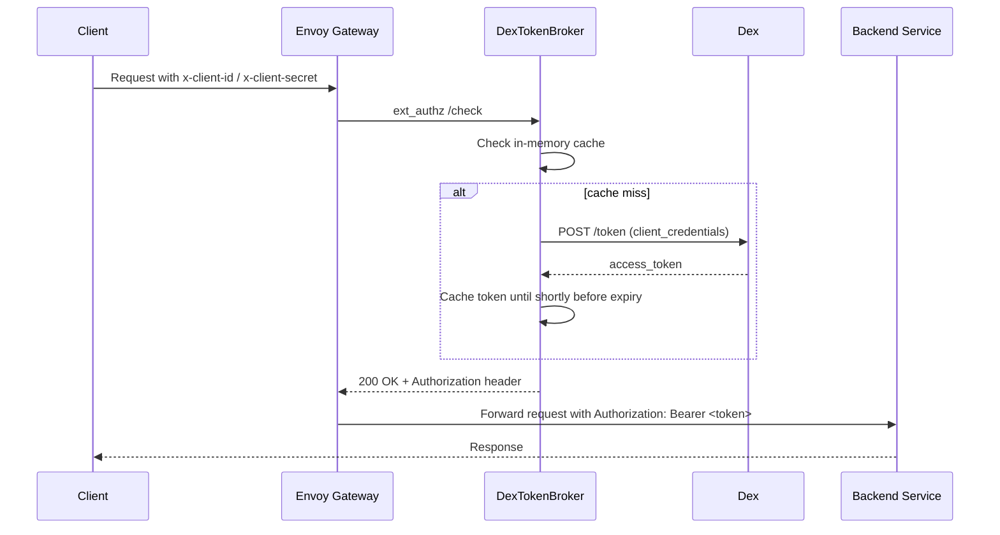
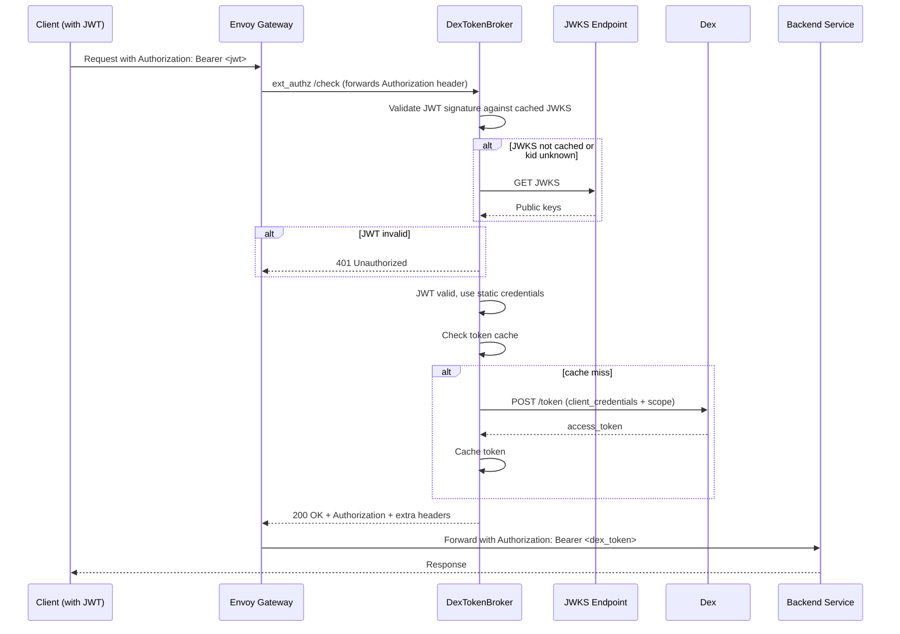

<div align="center">
  
  <h1>Dex Token Broker</h1>
  <p>Trading OAuth2 tokens from Dex for Envoy Gateway.</p>
</div>

DexTokenBroker is a lightweight external authorization service for Envoy Gateway. It performs OAuth2 `client_credentials` requests against Dex, caches access tokens in memory, and returns `Authorization: Bearer ...` headers that Envoy can forward to backend services.

The project is built for the `ext_authz` pattern: Envoy calls DexTokenBroker first, DexTokenBroker fetches or reuses a token, and the backend receives an already-authorized request.

## Why this exists

Envoy Gateway is good at routing, policy enforcement, and header forwarding, but it does not natively execute OAuth2 client flows. If your backend trusts Dex-issued access tokens and Dex is only reachable inside the cluster, you need a small broker between Envoy and Dex.

DexTokenBroker fills that gap.

## Features

- Small Go service with no third-party runtime dependencies
- Designed for Envoy Gateway `ext_authz`
- OAuth2 `client_credentials` support against Dex
- Optional JWT/JWKS validation gate to restrict access to trusted callers
- Configurable mapping of token response fields to upstream headers
- In-memory token cache with periodic cleanup
- Bounded cache size with a simple eviction policy
- Cache key includes a hash of the client secret, so rotated or incorrect secrets do not reuse another token
- In-flight request deduplication to avoid token refresh storms
- TLS-to-Dex by default, with an explicit insecure opt-out for local or trusted-network testing
- Strict request validation and bounded upstream response parsing
- Configurable inbound and outbound header names
- Optional static credentials mode for secret injection from the runtime environment
- Stateless per pod
- Ready for Docker and Kubernetes
- GitHub Actions CI
- GitHub Container Registry publishing
- Release Please for SemVer + Conventional Commits
- Dependabot for Go modules, Docker, and GitHub Actions
- Security workflow with `govulncheck` and Trivy

## Request flow

### Standard mode (credential headers)


```mermaid
sequenceDiagram
    participant C as Client
    participant E as Envoy Gateway
    participant B as DexTokenBroker
    participant D as Dex
    participant S as Backend Service

    C->>E: Request with x-client-id / x-client-secret
    E->>B: ext_authz /check
    B->>B: Check in-memory cache
    alt cache miss
        B->>D: POST /token (client_credentials)
        D-->>B: access_token
        B->>B: Cache token until shortly before expiry
    end
    B-->>E: 200 OK + Authorization header
    E->>S: Forward request with Authorization: Bearer <token>
    S-->>C: Response
```

### JWKS validation mode (trusted auth gateway)

When `JWKS_URL` is set, DexTokenBroker validates incoming JWTs before exchanging static credentials with Dex:


```mermaid
sequenceDiagram
    participant C as Client (with JWT)
    participant E as Envoy Gateway
    participant B as DexTokenBroker
    participant J as JWKS Endpoint
    participant D as Dex
    participant S as Backend Service

    C->>E: Request with Authorization: Bearer <jwt>
    E->>B: ext_authz /check (forwards Authorization header)
    B->>B: Validate JWT signature against cached JWKS
    alt JWKS not cached or kid unknown
        B->>J: GET JWKS
        J-->>B: Public keys
    end
    alt JWT invalid
        B-->>E: 401 Unauthorized
    end
    B->>B: JWT valid, use static credentials
    B->>B: Check token cache
    alt cache miss
        B->>D: POST /token (client_credentials + scope)
        D-->>B: access_token
        B->>B: Cache token
    end
    B-->>E: 200 OK + Authorization + extra headers
    E->>S: Forward with Authorization: Bearer <dex_token>
    S-->>C: Response
```

## Project layout

```text
.
├── .github/
│   ├── dependabot.yml
│   └── workflows/
├── cmd/dextokenbroker/
├── internal/tokenbroker/
├── CHANGELOG.md
├── Dockerfile
├── Makefile
└── README.md
```

## Configuration

DexTokenBroker is configured with environment variables:

| Variable | Default | Description |
| --- | --- | --- |
| `LISTEN_ADDR` | `:8080` | HTTP listen address |
| `DEX_TOKEN_URL` | `https://dex.dex.svc.cluster.local/token` | Dex OAuth2 token endpoint |
| `HTTP_TIMEOUT` | `5s` | Timeout for outbound token requests |
| `CACHE_CLEANUP_INTERVAL` | `5m` | How often expired tokens are removed |
| `EXPIRY_SAFETY_MARGIN` | `30s` | Buffer subtracted from `expires_in` before a token is treated as expired |
| `CACHE_MAX_ENTRIES` | `1024` | Maximum number of cached token entries; `0` disables caching |
| `ALLOW_INSECURE_DEX_URL` | `false` | Allow plain `http://` URLs for Dex and JWKS endpoints |
| `LOG_LEVEL` | `INFO` | Log level for the service logger |
| `SHUTDOWN_TIMEOUT` | `10s` | Graceful shutdown timeout |
| `UPSTREAM_AUTH_HEADER` | `Authorization` | Header returned to Envoy for the backend request |
| `UPSTREAM_TOKEN_HEADERS` | empty | Map token response JSON fields to extra response headers (see [Token header mapping](#token-header-mapping)) |
| `CLIENT_ID_HEADER` | `x-client-id` | Header name used to read the OAuth client ID |
| `CLIENT_SECRET_HEADER` | `x-client-secret` | Header name used to read the OAuth client secret |
| `SCOPE_HEADER` | `x-scope` | Header name used to read the OAuth scope |
| `STATIC_CLIENT_ID` | empty | Fixed OAuth client ID; overrides the incoming client-ID header |
| `STATIC_CLIENT_SECRET` | empty | Fixed OAuth client secret; overrides the incoming client-secret header |
| `STATIC_SCOPE` | empty | Fixed OAuth scope; overrides the incoming scope header (e.g. `openid email profile groups`) |
| `JWKS_URL` | empty | JWKS endpoint URL; when set, incoming requests must carry a valid JWT (see [JWT/JWKS validation](#jwtjwks-validation-gate)) |
| `JWKS_URLS` | empty | Comma-separated list of additional JWKS endpoints to trust; combined with `JWKS_URL`. A JWT is accepted if it validates against any one of them (see [Trusting multiple identity providers](#trusting-multiple-identity-providers)) |
| `JWKS_PROVIDERS` | empty | JSON array of `{url, issuer, audience}` objects to trust, each with its **own** issuer/audience allowlist (`issuer` and `audience` may be a string or an array). Combined with `JWKS_URL`/`JWKS_URLS`. Use this when each provider needs a different audience (see [Trusting multiple identity providers](#trusting-multiple-identity-providers)) |
| `JWT_HEADER` | `Authorization` | Header to read the incoming JWT from |
| `JWT_ISSUER` | empty | Global issuer allowlist applied to `JWKS_URL`/`JWKS_URLS` endpoints. If set, reject JWTs whose `iss` claim does not match. Accepts a comma-separated list |
| `JWT_AUDIENCE` | empty | Global audience allowlist applied to `JWKS_URL`/`JWKS_URLS` endpoints. If set, reject JWTs whose `aud` claim does not contain an expected value. Accepts a comma-separated list |

## API

### `POST /check`

Expected request headers by default:

- `x-client-id`
- `x-client-secret`
- `x-scope` (optional)

Those names can be changed with `CLIENT_ID_HEADER`, `CLIENT_SECRET_HEADER`, and `SCOPE_HEADER`.

Success response:

```http
HTTP/1.1 200 OK
Authorization: Bearer <access_token>
```

Failure responses:

- `401 Unauthorized` for missing or rejected credentials
- `502 Bad Gateway` for invalid responses from Dex
- `503 Service Unavailable` if Dex cannot be reached

### `GET /healthz`

Returns `200 OK` with body `ok`.

## JWT/JWKS validation gate

When `JWKS_URL` is set, DexTokenBroker acts as a trusted-auth gateway: every request to `/check` must carry a valid JWT in the configured header (`JWT_HEADER`, default `Authorization`). The broker validates the JWT signature against the JWKS endpoint and checks standard claims before exchanging static credentials with Dex.

This mode requires `STATIC_CLIENT_ID` to be set. `STATIC_CLIENT_SECRET` is optional — if omitted, the secret is read from the incoming request header as usual. The broker uses the resolved credentials for all Dex token requests once the incoming JWT is verified.

**What is validated:**

- JWT signature against public keys from the JWKS endpoint (RSA and ECDSA)
- Algorithm allowlist: only `RS256`, `RS384`, `RS512`, `ES256`, `ES384`, `ES512`
- Algorithm must match the key's registered algorithm in JWKS
- `exp` claim is required and must not be in the past
- `nbf` claim, if present, must be in the past
- `iss` claim, if an issuer allowlist is configured for the matching provider, must match one of its issuers
- `aud` claim, if an audience allowlist is configured for the matching provider, must contain one of its audiences
- Minimum RSA key size of 2048 bits
- Maximum JWT size of 16 KB

**JWKS key caching:**

Keys are fetched lazily on the first request and cached in memory. If a JWT presents an unknown `kid`, the broker refreshes the JWKS endpoint (rate-limited to once per 5 minutes after a successful refresh). Failed fetches are retried immediately on the next request to preserve recovery behavior; apply ingress rate limits to bound retry traffic during outages. Known keys remain cached until a successful refresh or process restart; deployments requiring immediate key revocation should account for this limitation.

**Example configuration:**

```bash
JWKS_URL=https://auth.example.com/.well-known/jwks.json
JWT_HEADER=Authorization
JWT_ISSUER=https://auth.example.com
JWT_AUDIENCE=my-service
STATIC_CLIENT_ID=dex-client
STATIC_CLIENT_SECRET=dex-secret
STATIC_SCOPE=openid email profile groups
```

### Trusting multiple identity providers

To accept JWTs from more than one issuer (for example two Auth0 tenants and
Entra), list every JWKS endpoint. Each endpoint is treated as an independent
trust domain, and a JWT is accepted as soon as it validates against any one of
them. Because each provider signs with its own keys, a token issued by one
provider can never be validated by another provider's keys.

There are two ways to configure this, and they can be combined.

#### Per-provider issuer and audience (recommended)

Use `JWKS_PROVIDERS` when each provider needs its **own** issuer and audience —
this is the correct choice for multi-tenant setups, since it prevents a token
minted for one provider's audience from being accepted at another. `issuer` and
`audience` may each be a string or an array of strings, and both are optional
(omit to skip that check for the provider):

```bash
JWKS_PROVIDERS='[
  {"url":"https://customer1.eu.auth0.com/.well-known/jwks.json",
   "issuer":"https://customer1.eu.auth0.com/",
   "audience":"api://customer1"},
  {"url":"https://login.microsoftonline.com/<tenant>/discovery/v2.0/keys",
   "issuer":"https://login.microsoftonline.com/<tenant>/v2.0",
   "audience":["api://entra","api://entra-legacy"]},
  {"url":"https://customer2.us.auth0.com/.well-known/jwks.json",
   "issuer":"https://customer2.us.auth0.com/",
   "audience":"api://customer2"}
]'
STATIC_CLIENT_ID=dex-client
STATIC_CLIENT_SECRET=dex-secret
```

#### Shared issuer/audience allowlist

If every provider shares the same audience, the lighter `JWKS_URLS` form pairs
with the global `JWT_ISSUER`/`JWT_AUDIENCE` allowlists (both accept
comma-separated lists). `JWKS_URLS` is combined with `JWKS_URL`, so existing
single-endpoint configurations keep working unchanged:

```bash
JWKS_URL=https://customer1.eu.auth0.com/.well-known/jwks.json
JWKS_URLS=https://login.microsoftonline.com/<tenant>/discovery/v2.0/keys,https://customer2.us.auth0.com/.well-known/jwks.json
JWT_ISSUER=https://customer1.eu.auth0.com/,https://login.microsoftonline.com/<tenant>/v2.0,https://customer2.us.auth0.com/
JWT_AUDIENCE=my-service
STATIC_CLIENT_ID=dex-client
STATIC_CLIENT_SECRET=dex-secret
```

Endpoints from `JWKS_PROVIDERS`, `JWKS_URL`, and `JWKS_URLS` are all merged
(deduplicated by URL, with `JWKS_PROVIDERS` taking precedence).

## Token header mapping

By default, the broker returns a single `Authorization: Bearer <token>` header. With `UPSTREAM_TOKEN_HEADERS`, you can expose additional fields from the Dex token response as separate response headers. Envoy's `headersToBackend` can then forward them to the backend.

**Format:** comma-separated `json_field:header_name` pairs. If `:header_name` is omitted, the JSON field name is used as the header name.

**Examples:**

```bash
# Expose access_token as a raw header (no Bearer prefix)
UPSTREAM_TOKEN_HEADERS=access_token

# Map to a custom header name
UPSTREAM_TOKEN_HEADERS=access_token:X-Access-Token

# Multiple mappings
UPSTREAM_TOKEN_HEADERS=access_token,token_type:X-Token-Type
```

Any string or numeric field from the Dex token response JSON can be mapped. The mapped values are cached alongside the token, so no extra overhead on cache hits.

**Envoy Gateway SecurityPolicy with extra headers:**

```yaml
extAuth:
  headersToExtAuth:
    - Authorization
  http:
    backendRefs:
      - name: dex-token-broker
        port: 8080
    path: /check
    headersToBackend:
      - Authorization
      - access_token
```

## Local development

Run the broker locally:

```bash
go run ./cmd/dextokenbroker
```

Run tests:

```bash
go test ./...
```

Format code:

```bash
make fmt
```

Build the binary:

```bash
make build
```

Print version information:

```bash
go run ./cmd/dextokenbroker --version
```

## Docker

Build the container locally:

```bash
docker build -t dextokenbroker:dev .
```

Run it:

```bash
docker run \
  -p 8080:8080 \
  -e DEX_TOKEN_URL=https://dex.dex.svc.cluster.local/token \
  dextokenbroker:dev
```

Published images are intended for GitHub Container Registry:

```text
ghcr.io/matzegebbe/dextokenbroker
```

Release tags publish at least these image tags:

- `v1.2.3`
- `1.2.3`
- `1.2`
- `latest`

Example configuration files:

- [.env.example](.env.example)
- [examples/k8s-deployment.yml](examples/k8s-deployment.yml)

## Envoy Gateway integration

The simplest pattern is to have DexTokenBroker return the final `Authorization` header and let Envoy forward that header upstream.

### Standard mode

1. The client calls an `HTTPRoute` on Envoy Gateway.
2. Envoy sends an `ext_authz` request to DexTokenBroker at `/check`.
3. Envoy forwards `x-client-id`, `x-client-secret`, and optionally `x-scope` to DexTokenBroker.
4. DexTokenBroker returns `Authorization: Bearer <token>`.
5. Envoy forwards that `Authorization` header to the backend service.

```yaml
apiVersion: gateway.envoyproxy.io/v1alpha1
kind: SecurityPolicy
metadata:
  name: dex-token-broker
spec:
  targetRefs:
    - group: gateway.networking.k8s.io
      kind: HTTPRoute
      name: my-api
  extAuth:
    headersToExtAuth:
      - x-client-id
      - x-client-secret
      - x-scope
    http:
      backendRefs:
        - name: dex-token-broker
          port: 8080
      path: /check
      headersToBackend:
        - Authorization
```

### JWKS validation mode with extra headers

When `JWKS_URL` is set, the broker validates the caller's JWT and exchanges fixed credentials with Dex. Use `UPSTREAM_TOKEN_HEADERS` to expose additional token fields as headers that Envoy can forward.

```yaml
apiVersion: gateway.envoyproxy.io/v1alpha1
kind: SecurityPolicy
metadata:
  name: dex-token-broker
spec:
  targetRefs:
    - group: gateway.networking.k8s.io
      kind: HTTPRoute
      name: my-api
  extAuth:
    headersToExtAuth:
      - Authorization
    http:
      backendRefs:
        - name: dex-token-broker
          port: 8080
      path: /check
      headersToBackend:
        - Authorization
        - access_token
```

If you change `UPSTREAM_AUTH_HEADER`, Envoy must forward that header name instead.

Field names and placement have shifted across some Envoy Gateway releases, so treat the YAML above as the target pattern and align it with the exact version of Envoy Gateway you deploy.

## Kubernetes example

Minimal Deployment:

```yaml
apiVersion: apps/v1
kind: Deployment
metadata:
  name: dex-token-broker
spec:
  replicas: 2
  selector:
    matchLabels:
      app: dex-token-broker
  template:
    metadata:
      labels:
        app: dex-token-broker
    spec:
      containers:
        - name: dex-token-broker
          image: ghcr.io/matzegebbe/dextokenbroker:latest
          ports:
            - containerPort: 8080
          env:
            - name: DEX_TOKEN_URL
              value: https://dex.dex.svc.cluster.local/token
          securityContext:
            allowPrivilegeEscalation: false
            capabilities:
              drop:
                - ALL
            readOnlyRootFilesystem: true
            runAsNonRoot: true
            seccompProfile:
              type: RuntimeDefault
          readinessProbe:
            httpGet:
              path: /healthz
              port: 8080
          livenessProbe:
            httpGet:
              path: /healthz
              port: 8080
```

## Cache behavior

The cache stores tokens, not raw credentials.

The cache key is derived from:

- `client_id`
- `scope`
- SHA-256 hash of `client_secret`

That keeps the service stateless while preventing a token minted for one secret from being reused by a different secret for the same client ID.

The cache is bounded by `CACHE_MAX_ENTRIES`. When the cache reaches capacity, DexTokenBroker first removes expired entries and then evicts the entry that expires soonest.

Expired tokens are removed in two ways:

- lazily on read when an expired entry is accessed
- periodically by a background cleanup goroutine

The broker also deduplicates concurrent cache misses per cache key, which helps avoid a burst of identical `/token` requests when a token expires under load.

## Security notes

- Always use TLS between clients, Envoy Gateway, DexTokenBroker, and Dex.
- DexTokenBroker rejects insecure `http://` Dex and JWKS endpoints by default. If you intentionally run them over plain HTTP, set `ALLOW_INSECURE_DEX_URL=true`.
- Do not log client secrets.
- `x-client-id`, `x-client-secret`, and `x-scope` are length-limited and rejected if they contain control characters.
- Dex token responses are size-limited and the broker rejects non-Bearer token types.
- If all traffic should use one fixed machine client, prefer storing the credentials in Kubernetes Secrets and letting DexTokenBroker own them instead of forwarding credentials from external clients.
- `STATIC_CLIENT_ID` and `STATIC_CLIENT_SECRET` are intended for that fixed machine-client mode.
- When `JWKS_URL` is set, configure `JWT_ISSUER` and `JWT_AUDIENCE` to prevent token reuse across services.
- JWT validation enforces an explicit algorithm allowlist (RS256/384/512, ES256/384/512), rejects `alg=none` and symmetric algorithms, requires the `exp` claim, enforces minimum RSA key sizes (2048 bits), and rate-limits JWKS refresh to prevent endpoint abuse.
- The in-memory cache is pod-local by design. That keeps the service simple, but each replica has its own cache.
- The published container image is non-root, distroless, emits SBOM/provenance on release, and its source/configuration is scanned in CI.

## CI, releases, and automation

This repository is set up for GitHub from day one.

### CI

PRs and pushes to `main` call the shared `verify.yml` workflow. Release jobs use
that same workflow at the resolved tag commit before publishing. Checks are
blocking: formatting, `go mod tidy` consistency, Staticcheck, `go vet`, normal
and race tests, `govulncheck`, source/configuration/secret scanning with Trivy,
binary startup and graceful shutdown, Docker build and image vulnerability scan,
and GoReleaser validation.
The weekly security run repeats verification against newly disclosed findings.
Go comes from `go.mod`; keep the Docker builder on the same patched version.
There are no third-party runtime modules, so no `go.sum` is currently needed.

Run `make verify` locally with the Go version in `go.mod`. CI additionally runs
Trivy, Docker, and `goreleaser check` (GoReleaser v2.18.1).

### Conventional Commits

Commit messages should follow Conventional Commits so Release Please can determine the next semantic version.

Examples:

```text
feat: add optional static credentials mode
fix: return 503 when dex is unavailable
docs: expand envoy gateway integration guide
chore(ci): update build-push-action
```

### Semantic Versioning

Releases follow SemVer:

- `fix:` -> patch release
- `feat:` -> minor release
- `feat!:` or `BREAKING CHANGE:` -> major release

### Creating releases

Release Please manages version PRs, `.release-please-manifest.json`, and
`CHANGELOG.md`. Merge Conventional Commits into `main`, review its release PR,
then merge the PR. Dependency/toolchain version bumps do not themselves mean
that the application needs a new version; `chore:` commits do not normally
trigger a release. Use `fix:` or `feat:` for corresponding application changes.

Release Please creates a **draft** and a tag using `GITHUB_TOKEN`, then explicitly
calls `release.yml`. This avoids relying on a tag event that GitHub suppresses
for its own token. The tag is created immediately even for a draft. Verification
runs before GoReleaser uploads assets; the release becomes public only after
binaries, attestations, and the container have completed.

Alternatively, push an existing `main` commit with a stable tag such as `v1.2.3`:

```sh
git tag v1.2.3 <commit-on-main>
git push origin v1.2.3
```

Only `vX.Y.Z` without leading zeroes is accepted; prerelease tags are not currently
supported. Manual tags should agree with the version manifest/changelog to keep
subsequent Release Please version calculations consistent. Do not move published
tags. To retry a failed draft, rerun its failed workflow or dispatch `release.yml`
with the same tag. Runs serialize by tag and already published releases are
skipped. GoReleaser reuses the draft and preserves Release Please's notes; manual
tags receive generated notes. A partial failure may leave draft assets or a
container in GHCR; inspect those before retrying. Publishing to GitHub and GHCR
cannot be a single atomic transaction.

### Artifacts and reproducibility

- Binaries for Linux, macOS, and Windows on amd64 and arm64; Windows uses ZIP,
  other platforms use tar.gz. Archives include the license and documentation.
- SHA-256 `checksums.txt` and GitHub build provenance attestations for archives.
- Multi-platform `ghcr.io/<owner>/dextokenbroker` images for linux/amd64 and
  linux/arm64, including BuildKit SBOM and provenance. Existing `vX.Y.Z`, `vX.Y`,
  `sha-*`, and `latest` image tags are retained.

GoReleaser uses a fixed Go version, CGO disabled, trimmed paths, an empty build ID,
and commit-based timestamps. `--version` reports version, commit, and build date
using the application's existing ldflags. To test packaging without publishing:

```sh
goreleaser check
goreleaser release --snapshot --clean
(cd dist && sha256sum -c checksums.txt)
```

For provenance, use `gh attestation verify <archive> --repo <owner>/<repository>`.
Binary SBOMs are not generated; SBOM coverage currently applies to container
images. Docker base tags remain Dependabot-managed and may change, so rebuilding
an old image is not guaranteed byte-identical. Publish releases in version order:
retrying an older unpublished tag can move the mutable `latest` image tag.

### GitHub repository settings

- Enable Actions and allow GitHub Actions to create pull requests. Protect `main`
  with the `verify / test` CI check, review requirements, and no force pushes.
- Protect `v*` tags from modification/deletion; allow the release automation to
  create them. Release jobs require repository contents and GHCR package writes.
- The built-in `GITHUB_TOKEN` publishes releases and images. No cloud credentials
  or publishing PAT is needed. OIDC is used for archive provenance attestations.
- Optional `RELEASE_PLEASE_PAT`: a fine-grained token limited to this repository
  with contents and pull-request write permissions, used **only for release PRs**
  so their creation triggers CI. Without it, GitHub suppresses CI on bot-created
  PRs; close/reopen the release PR as a maintainer to trigger the required checks.
  A GitHub App installation token is a suitable short-lived alternative.
- Confirm GHCR grants this repository Actions access to the existing package.
  Confirm artifact attestations are available for the repository/plan.
- Enable private vulnerability reporting as described in `SECURITY.md`.

### Dependency maintenance

Dependabot maintains Go, GitHub Actions (including SHA pins), and Docker images.
Staticcheck, govulncheck, and GoReleaser versions are pinned in the workflows;
review their versions during toolchain updates. Trivy complements govulncheck
with secret and configuration scanning and fails on high/critical findings.

## License

Apache License 2.0. See [LICENSE](LICENSE).
